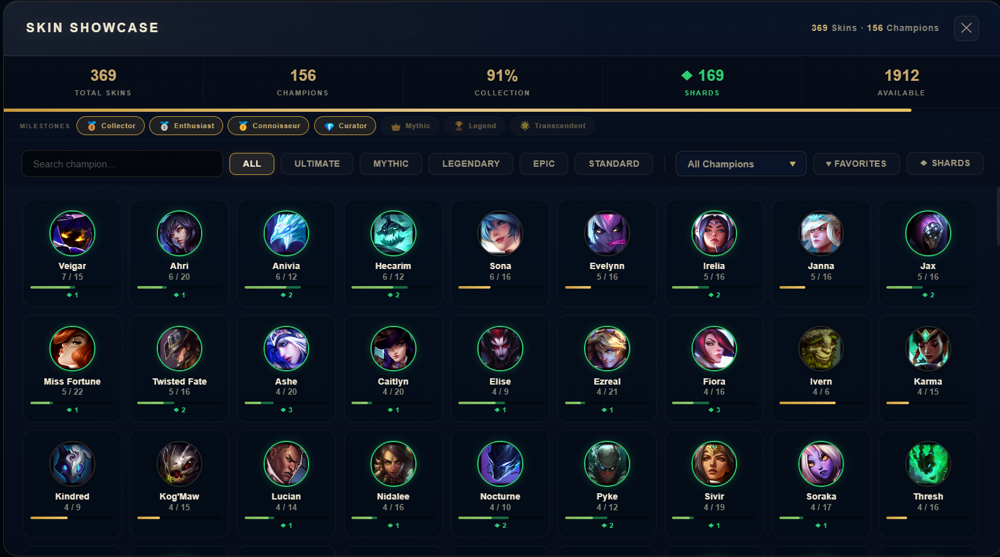
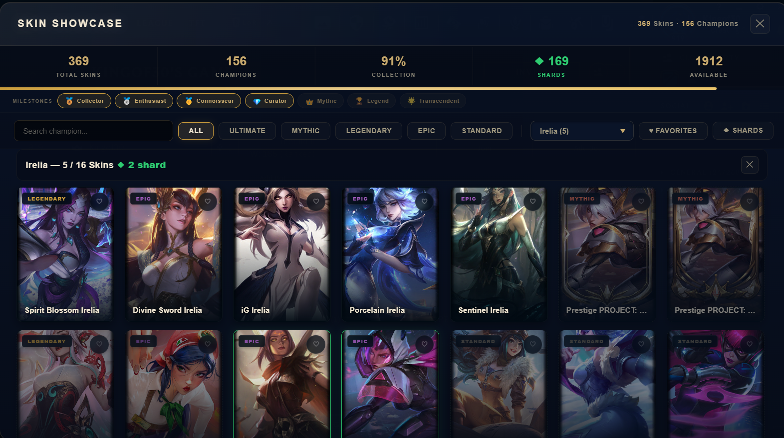
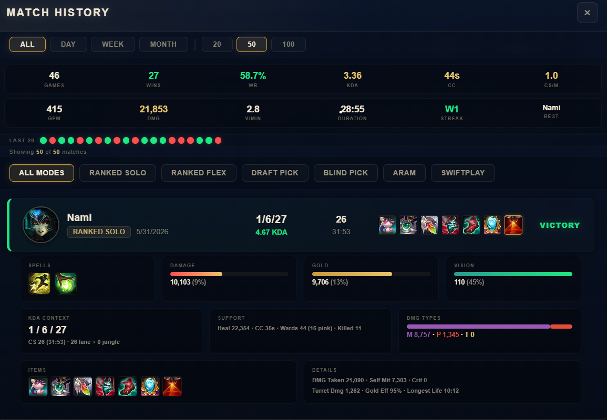

<div align="center">

# KO3-Pengu-Plugins [League of Legends Client]

**A collection of [Pengu Loader](https://pengu.lol/) plugins — quality-of-life features, skin showcase browser, and detailed match history viewer.**

[](LICENSE)
[](https://pengu.lol/)
[](https://github.com/HassanSalah120/KO3-Pengu-Plugins/releases)
[](https://github.com/HassanSalah120/KO3-Pengu-Plugins/stargazers)
[](https://github.com/HassanSalah120/KO3-Pengu-Plugins/issues)

</div>

---

## 📋 Table of Contents

- [Overview](#-overview)
- [Plugins](#-plugins)
  - [A-KO3-Utils](#a-ko3-utils--shared-utilities)
  - [KO3-QoL](#ko3-qol--quality-of-life)
  - [KO3-SkinShowcase](#ko3-skinshowcase--skin-collection-browser)
  - [KO3-MatchHistory](#ko3-matchhistory--match-history-viewer)
- [Installation](#-installation)
- [Screenshots](#-screenshots)
- [FAQ](#-faq)
- [Contributing](#-contributing)
- [Support](#-support)
- [License](#-license)

---

## 📖 Overview

KO3 Plugins provide three powerful tools for the League of Legends Client:

| Plugin | Description |
|--------|-------------|
| **KO3-QoL** | 40+ quality-of-life toggles: auto-accept, auto-skip EOG, desktop notifications, profile customization, champion mastery overlay, and more |
| **KO3-SkinShowcase** | Browse your full skin collection with shard tracking, favorites, tier filters, and splash art previews |
| **KO3-MatchHistory** | Detailed match history with per-game stats, performance tracking, and aggregate statistics |

---

## 🧩 Plugins

### A-KO3-Utils — Shared Utilities

Core library required by all KO3 plugins. Provides LCU API wrapper, overlay panel system, nav button factory, and DOM utilities.

| Feature | Description |
|---------|-------------|
| LCU Fetch Wrapper | HTTP calls against the local LCU REST API with error handling |
| Panel Factory | Overlay panel with open/close/toggle + mutual exclusion between KO3 panels |
| Nav Button Factory | Navigation bar button with SVG icon, automatic retry on dynamic menus |
| CSS Injector | Stylesheet injection with cache-busting query parameter |
| Phase Nav Handler | Auto-show/hide nav button based on gameflow phase (Lobby/Matchmaking vs InProgress) |
| HTML Escaper | XSS-safe string escaping for dynamic content |
| Logger Factory | Prefixed `console.info`/`console.error` helpers |

---

### KO3-QoL — Quality of Life

Access the settings panel via the **shield icon** in the top-right navigation bar. All features are toggleable with instant apply.

<details>
<summary><b>⚙️ Matchmaking</b></summary>

| Feature | Description |
|---------|-------------|
| **Auto-Accept** | Automatically accepts ready checks |
| **Auto-Requeue** | Re-enters matchmaking queue after a game ends |
| **Queue Pop Sound** | Plays a configurable beep (volume slider) when a match is found |
| **Queue Pop Flash** | Full-screen flash overlay on ready check |
| **Auto-Set Roles** | Sets primary/secondary role preference when entering queue |
| **Quick Join** | One-click buttons for Blind, Draft, Ranked Solo, Ranked Flex, ARAM, URF |

</details>

<details>
<summary><b>⚔️ Champion Select</b></summary>

| Feature | Description |
|---------|-------------|
| **Dodge Button** | Floating button to dodge champ select |
| **Timer Overlay** | Large visible countdown during pick/ban phases |
| **Queue Timer** | Live elapsed time display while matchmaking |
| **Lobby Reveal** | Reveals summoner names behind champion selects |
| **Mastery Overlay** | Floating panel showing mastery level + points for all players, resolves hovered champions |
| **Random Skin** | Picks a random owned skin for your selected champion |
| **Auto Message** | Sends a configurable chat message when champ select begins |
| **Auto Lock-In** | Auto-picks and locks a champion on your turn (searchable picker, configurable delay) |
| **Auto Ban** | Auto-bans a champion on your ban turn (searchable picker) |

</details>

<details>
<summary><b>🏁 End of Game</b></summary>

| Feature | Description |
|---------|-------------|
| **Skip Honor Screen** | Auto-dismisses the post-game honor screen |
| **Auto-Skip EOG** | Skips the spinning end-of-game stats screen (configurable 10–120s delay) |
| **Auto-Honor** | Auto-honors a player — random, best KDA, first, or support |
| **Teammates Only** | Restricts auto-honor to teammates only |
| **Auto-GG** | Sends a configurable "gg" chat message after the game |

</details>

<details>
<summary><b>👥 Social & Tools</b></summary>

| Feature | Description |
|---------|-------------|
| **Friends Notifier** | OS notifications when friends change online status |
| **Quick Invite** | One-click invite recent teammates to your lobby |
| **Mission Claimer** | Claims all completed mission rewards with a single click |
| **Friend Manager** | Bulk-remove offline, DND, or mobile friends |

</details>

<details>
<summary><b>🎨 Profile Customization</b></summary>

| Feature | Description |
|---------|-------------|
| **Background Image** | Set any champion skin as your profile loading screen background (champion picker → skin picker → apply) |
| **Profile Icon** | Change summoner icon by ID with live preview image |
| **Challenge Badges** | Equip up to 3 challenge medals on your profile (by ID) |
| **Status Message** | Custom presence text visible to friends |

</details>

<details>
<summary><b>🎮 Custom Games</b></summary>

| Feature | Description |
|---------|-------------|
| **Create Custom** | Custom lobby with configurable mode, map, team size, spectator policy |
| **Add Bot** | Add a bot to the lobby |
| **Start Custom** | Launch champ select for the custom game |

</details>

<details>
<summary><b>🔔 Notifications & Display</b></summary>

| Feature | Description |
|---------|-------------|
| **Desktop Notifications** | OS-level notifications for queue pop, game start, and game end (individually togglable) |
| **Hide Badges** | Suppresses notification badges and dots across the client UI |
| **Clean Home Page** | Removes news, featured content, sales banners, "Your Shop", pass promotions, esports, partner content |

</details>

<details>
<summary><b>⚡ System</b></summary>

| Feature | Description |
|---------|-------------|
| **Auto-Reload** | Periodically reloads the client to free memory (15–240 min interval) |
| **Performance Mode** | Disables CSS animations and transitions for smoother performance |
| **Appear Offline** | Sets chat availability to offline without blocking network |
| **Skin Shard Indicators** | Enables green shard badges inside KO3-SkinShowcase |

</details>

---

### KO3-SkinShowcase — Skin Collection Browser

Access via the **image icon** in the top-right navigation bar. Browse all your skins with shard tracking, favorites, and filters.

| Feature | Description |
|---------|-------------|
| **Champion Cards** | Grid with owned/total counts, progress bars, and shard overlays |
| **Expanded Skin Grid** | Click a champion to see all skins sorted by tier then name |
| **Skin Preview** | Click any tile for full splash art in a modal |
| **Skin Shard Indicators** | Green border/glow on cards with shards, ◆ badge on shard skin tiles, shard count row |
| **Favorites** | ♥ toggle per skin, persisted locally, filter by favorites only |
| **Tier Filtering** | All / Ultimate / Mythic / Legendary / Epic / Standard |
| **Shards Filter** | Show only champions with available skin shards |
| **Champion Search** | Type to filter by name |
| **Collection Stats** | Total skins, champion coverage %, shard count |
| **Milestones** | Track progress toward collection milestones (50–1000 skins) |
| **Live Data** | Fetches real-time skin ownership and loot data from LCU |

---

### KO3-MatchHistory — Match History Viewer

Access via the **bar-chart icon** in the top-right navigation bar.

| Feature | Description |
|---------|-------------|
| **Match List** | Champion icon, name, queue type, date, KDA, CS, duration, items, result (Win/Loss) |
| **Expanded Details** | Click any match for spells, runes, damage share, gold share, vision share, damage types, full items, advanced stats |
| **Stats Bar** | Games, wins, WR%, KDA, CC time, CS/min, GPM, damage, V/min, avg duration, streak, best champion |
| **Win/Loss Sparkline** | Visual streak for the last 20 matches |
| **Filters** | By queue (All, Ranked Solo, Ranked Flex, Draft, Blind, ARAM, Swiftplay), period (Day/Week/Month/All), count (20/50/100) |
| **Data Caching** | 5-minute TTL cache for API responses |

---

## 📦 Installation

### Prerequisites

- [Pengu Loader](https://pengu.lol/) v1.1.6 or newer
- League of Legends Client

### Quick Install

```ps1
# Clone or download the repository
git clone https://github.com/HassanSalah120/KO3-Pengu-Plugins.git

# Copy plugins to Pengu Loader's plugins folder
# Copy the plugin folders you want into:
# %LOCALAPPDATA%\Rose\Pengu Loader\plugins\
```

### Manual Install

1. Download the [latest release](https://github.com/HassanSalah120/KO3-Pengu-Plugins/releases)
2. Extract the plugin folders you want (`A-KO3-Utils`, `KO3-QoL`, `KO3-SkinShowcase`, `KO3-MatchHistory`)
3. Copy them into your Pengu Loader `plugins/` directory
4. Restart the League Client

> **Note:** `A-KO3-Utils` is required by all other KO3 plugins. Make sure to always include it.

---

## 📸 Screenshots

### KO3-SkinShowcase

| Champion Grid | Expanded Skin View |
|:---:|:---:|
|  |  |

### KO3-MatchHistory



---

## ❓ FAQ

**Q: Do I need all plugins?**
No. Each plugin works independently, though `A-KO3-Utils` must be present as a dependency.

**Q: Will these plugins get me banned?**
Pengu Loader is a read-only LCU API client. These plugins do not automate gameplay or modify game memory. Use at your own risk.

**Q: Do the settings persist after closing the client?**
Yes. All settings are saved via Pengu Loader's `DataStore` and survive client restarts.

## 🤝 Contributing

Contributions are welcome! Here's how you can help:

- **Report a bug** — [Open an issue](https://github.com/HassanSalah120/KO3-Pengu-Plugins/issues/new?template=bug_report.md)
- **Suggest a feature** — [Open a feature request](https://github.com/HassanSalah120/KO3-Pengu-Plugins/issues/new?template=feature_request.md)
- **Submit code** — Fork the repo, create a feature branch, and open a pull request
- **Share screenshots** — Add your screenshots to `screenshots/` and update the README

### Development

```ps1
git clone https://github.com/HassanSalah120/KO3-Pengu-Plugins.git
cd KO3-Pengu-Plugins
# Edit files directly, no build step required
```

Then copy the folders to your Pengu Loader `plugins/` directory and restart the client.

---

## 💬 Support

- **Issues** — [GitHub Issues](https://github.com/HassanSalah120/KO3-Pengu-Plugins/issues)
- **Discussions** — [GitHub Discussions](https://github.com/HassanSalah120/KO3-Pengu-Plugins/discussions)

---

## 📄 License

This project is licensed under the MIT License — see the [LICENSE](LICENSE) file for details.

<p align="center">
  <sub>Built for the <a href="https://pengu.lol/">Pengu Loader</a> community. Not affiliated with Riot Games.</sub>
</p>
